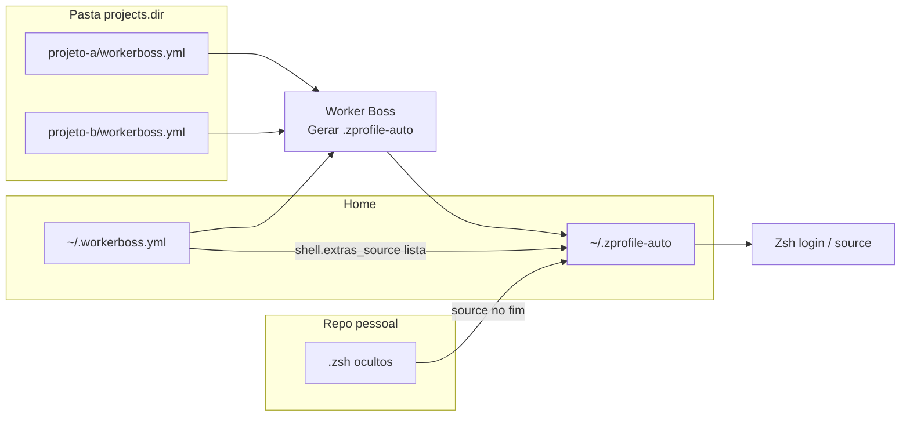

# workerboss-extras

Repositório **pessoal** de shell (Zsh) que complementa o [Worker Boss](https://github.com/CeruttiMaicon/worker-boss): o conteúdo principal costuma ir em **`.workerboss-extras.zsh`** (ficheiro oculto); podes acrescentar outros **`.zsh` ocultos** (ex.: `.workerboss-local.zsh` só para esta máquina) e listar **todos** em `shell.extras_source` no **`~/.workerboss.yml`** — o Worker Boss gera um `source` por entrada, **na ordem da lista**.

---

## Como isto encaixa no Worker Boss

O Worker Boss é a ferramenta que corre no teu PC (menu Whiptail, `worker_boss.sh`, etc.). Ele trabalha com **três camadas** de configuração; este repo é a **terceira**:

| Camada | Onde fica | O que guardas |
|--------|-----------|-----------------|
| **1. Config global** | **`~/.workerboss.yml`** (oculto, na home) | `projects.dir`, `ignore_dirs`, e **`shell.extras_source`** como **lista** de paths para ficheiros Zsh. |
| **2. Por repositório** | `workerboss.yml` dentro de cada projeto (ex.: `srp/`, `VoleiClub/`) | Atalhos daquele app: Docker, testes, recreate, helpers, etc. |
| **3. Extras pessoais** | Este repo — vários **`.zsh` ocultos** | `clone_repo`, aliases multi-repo, `multiplier-*`, `update`, NVM/Go, etc. Separa por ficheiro (ex.: principal + `.workerboss-local.zsh` não partilhado ou vazio no git). |

O Worker Boss **não** executa os teus `.zsh` sozinho. O fluxo é:

1. Em **`~/.workerboss.yml`** defines `shell.extras_source` como **lista** de caminhos (`~` ou absoluto). Cada entrada vira um `source` no `.zprofile-auto`, pela mesma ordem.
2. No Worker Boss: **Gerar .zprofile-auto** (ou a função equivalente no script).
3. O gerador lê os `workerboss.yml` dos projetos, monta as funções dos atalhos e, **no fim**, para cada path em `extras_source`, um bloco `if [ -r … ]; then . …; fi`.
4. O Zsh carrega `~/.zprofile-auto` (normalmente via `~/.zshrc`). Primeiro o gerado; depois os teus ficheiros, **na ordem da lista**.

Ficheiros mais abaixo na lista podem usar ou redefinir o que os anteriores definiram. O `.zprofile-auto` continua gerado — não o edites à mão.



**YAML:** `shell` tem de estar no **mesmo nível** que `projects`, nunca indentado *dentro* de `projects`.

---

## Configuração rápida

1. Clona este repo (ex.: `~/Projects/workerboss-extras`).
2. No **`~/.workerboss.yml`**:

```yaml
projects:
  dir: "~/Projects"
  ignore_dirs: []

shell:
  extras_source:
    - "~/Projects/workerboss-extras/.workerboss-extras.zsh"
    # - "~/Projects/workerboss-extras/.workerboss-outro.zsh"
```

3. No Worker Boss: **Gerar .zprofile-auto**.
4. Abre um terminal novo ou `source ~/.zprofile-auto`.

---

## O que pôr em **`.workerboss-extras.zsh`**

- Aliases e funções **multi-repo** ou da tua máquina (`clone_repo`, `srp`, `VolleyTrackBack`, `update`, NVM, …).
- Evita **duplicar** o que já está num `workerboss.yml` de um projeto.

Podes acrescentar mais linhas na lista (outros `.zsh` ocultos no mesmo repo ou noutro path).

---

## Relação com o repositório `worker-boss`

- O código do Worker Boss fica no clone **público** `~/Projects/worker-boss` (ou o caminho que usares).
- Este repo **workerboss-extras** pode ser privado e versionado à parte.
- O `.zprofile-auto` **gerado** fica no projeto worker-boss (com symlink `~/.zprofile-auto` habitual).

Se mudares só o **conteúdo** dos `.zsh` (sem alterar a lista no YAML), **não** precisas de regenerar o `.zprofile-auto`. Regenera quando mudares atalhos nos `workerboss.yml` dos projetos ou quando **mudares a lista** em `shell.extras_source`.
