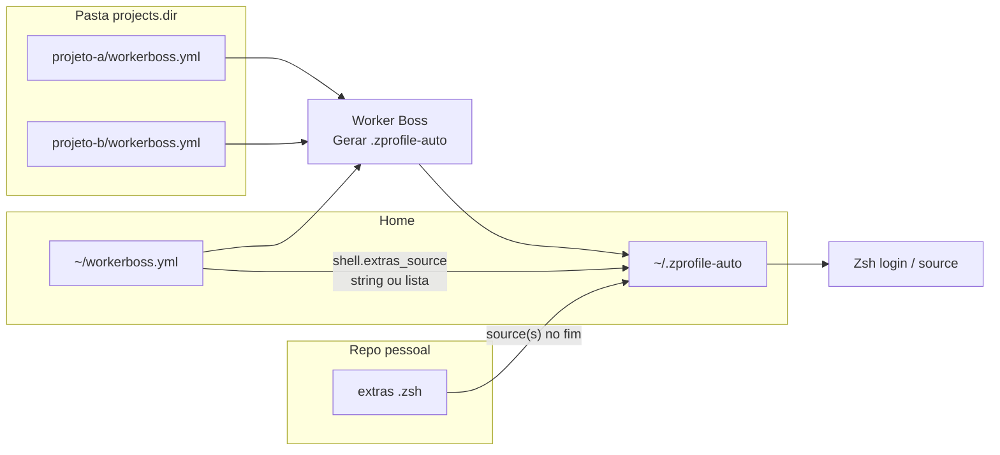

# workerboss-extras

Repositório **pessoal** de shell (Zsh) que complementa o [Worker Boss](https://github.com/CeruttiMaicon/worker-boss): normalmente começas por um ficheiro principal (`workerboss-extras.zsh`), mas podes partir o shell em **vários** `.zsh` e listá-los todos em `shell.extras_source` no `~/workerboss.yml` — o Worker Boss gera um `source` por ficheiro, **na ordem da lista**.

---

## Como isto encaixa no Worker Boss

O Worker Boss é a ferramenta que corre no teu PC (menu Whiptail, `worker_boss.sh`, etc.). Ele trabalha com **três camadas** de configuração; este repo é a **terceira**:

| Camada | Onde fica | O que guardas |
|--------|-----------|-----------------|
| **1. Config global** | `~/workerboss.yml` na tua home | Pasta dos projetos (`projects.dir`), pastas a ignorar, e `shell.extras_source`: **uma string** (um path) ou **uma lista** (vários paths, por ordem de carga). |
| **2. Por repositório** | `workerboss.yml` dentro de cada projeto (ex.: `srp/`, `VoleiClub/`) | Atalhos de trabalho daquele app: Docker, testes interativos, recriar ambiente, helpers tipo `srp-helper`, etc. |
| **3. Extras pessoais** | Este repo (um ou mais `.zsh`) | Coisas **tuas**: `clone_repo`, atalhos para vários clones, `multiplier-*`, `update`, NVM/Go, caminhos da máquina, etc. Podes separar por tema (ex.: `extras-git.zsh`, `extras-work.zsh`). |

O Worker Boss **não** executa o `workerboss-extras.zsh` sozinho. O fluxo é:

1. Editas `~/workerboss.yml` e defines `shell.extras_source` com um caminho (string) ou uma **lista** de caminhos (absoluto ou `~`). Cada entrada vira um `source` no `.zprofile-auto`, pela mesma ordem.
2. No Worker Boss escolhes **Gerar .zprofile-auto** (ou corres a função equivalente a partir do script).
3. O gerador lê todos os `workerboss.yml` sob `projects.dir`, monta funções com os nomes dos atalhos, e **no fim** do ficheiro gerado acrescenta, para cada path em `extras_source`, um bloco do género: se o ficheiro existir e for legível, faz `source`.
4. O teu Zsh carrega `~/.zprofile-auto` (normalmente via `~/.zshrc`, conforme o [README do Worker Boss](https://github.com/CeruttiMaicon/worker-boss/blob/main/README.md)). Na primeira parte tens o que veio dos YAMLs; na última parte, os teus extras (um ou vários, em sequência).

Ordem de carregamento: **primeiro** o conteúdo gerado a partir dos projetos, **depois** os ficheiros de extras **na ordem em que aparecem na lista** (ou o único ficheiro se usaste string). Ficheiros listados mais tarde podem usar ou redefinir o que ficheiros anteriores definiram. Isto evita editar o `.zprofile-auto` gerado (ele é sobrescrito sempre que gerares de novo).



**Atenção ao YAML:** a chave `shell` deve estar no **mesmo nível** que `projects` no `~/workerboss.yml`, não indentada *dentro* de `projects`. Se `shell` ficar aninhado em `projects`, o Worker Boss (versões antigas) pode não encontrar `extras_source` e o `.zprofile-auto` sai sem o bloco de extras. Versões recentes do `worker_boss.sh` também aceitam `projects.shell.extras_source` como compatibilidade, mas o recomendado é `shell` na raiz.

---

## Configuração rápida

1. Clona este repo (ex.: `~/Projects/workerboss-extras`).
2. No `~/workerboss.yml`:

```yaml
projects:
  dir: "~/Projects"
  ignore_dirs: []

shell:
  extras_source: "~/Projects/workerboss-extras/workerboss-extras.zsh"
  # Vários ficheiros (ordem = ordem de carga):
  # extras_source:
  #   - "~/Projects/workerboss-extras/workerboss-extras.zsh"
  #   - "~/Projects/workerboss-extras/outro.zsh"
```

3. No Worker Boss: **Gerar .zprofile-auto**.
4. Abre um terminal novo ou `source ~/.zprofile-auto`.

---

## O que pôr no `workerboss-extras.zsh`

- Aliases e funções **multi-repo** ou ligados à tua máquina (`clone_repo`, `srp`, `VolleyTrackBack`, `update`, NVM, …).
- Evita **duplicar** o que já está num `workerboss.yml` de um projeto (por exemplo o mesmo fluxo Docker que o atalho `volleytrack` já faz). Um único sítio por responsabilidade fica mais fácil de manter.

---

## Relação com o repositório `worker-boss`

- O código do Worker Boss (incluindo `worker_boss.sh` e o template do `.zprofile-auto`) fica no clone **público** `~/Projects/worker-boss` (ou o caminho que usares).
- Este repositório **workerboss-extras** pode ser privado, só teu, versionado à parte — não precisa de ir para o mesmo remote do Worker Boss.
- O ficheiro `.zprofile-auto` **gerado** continua a viver dentro do projeto worker-boss (e costuma haver um symlink `~/.zprofile-auto` → esse ficheiro); o gerado inclui um ou mais `source` para os paths configurados quando o YAML na home está correto.

Se alterares só o conteúdo dos `.zsh` de extras (sem mudar a lista de paths no YAML), **não** precisas de voltar a gerar o `.zprofile-auto` — os `source` apontam para os ficheiros atuais. Só precisas de **regenerar** quando mudares atalhos nos `workerboss.yml` dos projetos, ou quando **adicionares, removeres ou reordenares** entradas em `shell.extras_source`.
