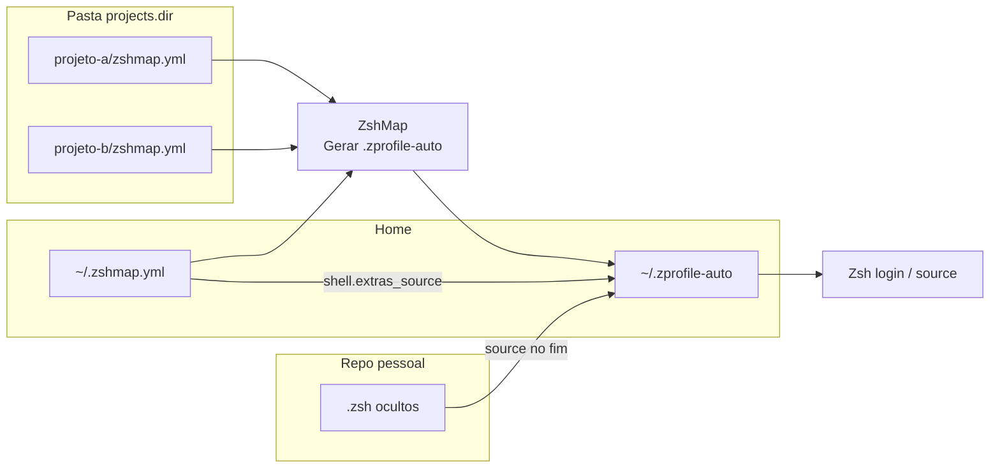

# zshmap-extras

Repositório **pessoal** de shell (Zsh) que complementa o **[ZshMap](https://github.com/CeruttiMaicon/zsh-map)** (repo **`zsh-map`**): o conteúdo principal costuma ir em **`.zshmap-extras.zsh`** (ficheiro oculto); podes acrescentar outros **`.zsh` ocultos** (ex.: `.zshmap-local.zsh`) e listar **todos** em `shell.extras_source` no **`~/.zshmap.yml`** — o ZshMap gera um `source` por entrada, **na ordem da lista**.

---

## Como isto encaixa no ZshMap

O ZshMap é a ferramenta que corre no teu PC (menu Whiptail, `zsh-map.sh`, etc.). Trabalha com **três camadas** de configuração; este repo é a **terceira**:

| Camada | Onde fica | O que guardas |
|--------|-----------|-----------------|
| **1. Config global** | **`~/.zshmap.yml`** (oculto, na home) | `projects.dir`, `ignore_dirs`, **`install.programs_dir`** (lista), **`shell.extras_source`** (lista de paths Zsh). |
| **2. Por repositório** | `zshmap.yml` dentro de cada projeto | Atalhos daquele app: Docker, testes, etc. |
| **3. Extras pessoais** | Este repo — **`.zsh` ocultos** e, se quiseres, **`programs/`** | Aliases multi-repo, `multiplier-*`, `update`, etc. Scripts de instalação do menu apontam-se em **`install.programs_dir`**; vê `programs/README.md`. |

O ZshMap **não** executa os teus `.zsh` sozinho. O fluxo é:

1. Em **`~/.zshmap.yml`**, `shell.extras_source` como **lista** de caminhos.
2. No ZshMap: **Gerar .zprofile-auto**.
3. O gerador lê os `zshmap.yml` dos projetos, monta as funções e, **no fim**, `source` condicional para cada extra.
4. O Zsh carrega `~/.zprofile-auto` (normalmente via `~/.zshrc`).



**YAML:** `shell` no **mesmo nível** que `projects`.

---

## Configuração rápida

1. Clona este repo para o sítio que preferires.
2. No **`~/.zshmap.yml`** (lista em `install.programs_dir` se usares scripts de instalação):

```yaml
projects:
  dir: "~/Projects"
  ignore_dirs: []

install:
  programs_dir:
    - "~/Projects/substitui-pelo-caminho-do-clone/programs"

shell:
  extras_source:
    - "~/Projects/substitui-pelo-caminho-do-clone/.zshmap-extras.zsh"
```

3. No ZshMap: **Gerar .zprofile-auto**.
4. Abre um terminal novo ou `source ~/.zprofile-auto`.

---

## O que pôr em **`.zshmap-extras.zsh`**

- Aliases e funções **multi-repo** ou da tua máquina.
- Evita **duplicar** o que já está num `zshmap.yml` de um projeto.

---

## Relação com o repositório **zsh-map**

- O código do ZshMap fica no clone **`zsh-map`** (path que definires).
- Este repo **zshmap-extras** pode ser privado.
- O `.zprofile-auto` **gerado** fica no clone do **zsh-map** (symlink `~/.zprofile-auto` habitual).

Regenera o `.zprofile-auto` quando mudares atalhos nos `zshmap.yml` ou a lista em `shell.extras_source`.
